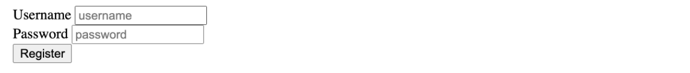

## HTML is about semantics

What is "**semantics**" ?

A sentence is a series of words. A title is also a series of words. And so is a subtitle. How can a computer know which is which? Semantics is about marking up what a series of information is to be considered as. It adds hierarchy and structure to a text. That's what HTML is for.

To make proper HTML code, one must think not about the looks of the text, but of its **structure** :sparkling_heart:.

**How ?** When writing html code, ask yourself this question: "_What is this series of words : a date ? A title? A paragraph? A legend? A caption describing an image ? And this series of sentences, is this a chapter ? A footnote ?_" the answer to that question will tell you which HTML tag to best use to describe the content.

Please read this article : https://www.semrush.com/blog/semantic-html5-guide/

### Why is semantics so important ?

Two reasons : **SEO** (your website's findability / visibility on Google) and **Accessibility** (make sure all humans, no matter their handicap (blindness, poor eyesight, colorblindness) can access the information.


#### 1.1 SEO

The ultimate goal of a search engine like Google is to return to a human the best possible results for what they have searched for (a few words). To do this, Google creates software such as **Googlebot**, which indexes content found on the web by following links from one page to another, from one site to another. (That's why we sometimes talk about _web spiders_).

Using powerful algorithms, Google reads and analyzes the HTML content of each page found, in order to "understand" what it is talking about thanks to its html structure (title, subtitle, list, etc.). This allows Google to determine what each page is about, and if it seems to match the search, it will return it to the user as one of the first results.

**Therefore, if our pages are not very semantic, Google will not show them, and your sites, no matter how cool they look and feel, will not have any traffic.**

> Findability Precedes Usability
> In the Alphabet and on the Web.
> You Can't Use What You Can't Find.
> – [Peter Morville](https://thatsthespir.it/quote/view/10)

#### 1.2 Accessibility

The web is a universal project: everyone must have access to content. Including the blind and visually impaired (you, one day). Blind people use "screen readers" that use html code to tell the story aloud. If your html code is not semantic, the page will not make much sense to listen to (even if it looks good). Feel free to [test on your own computer](https://stackoverflow.com/a/43368748/53960).

### Semantic is actually pretty easy.

Semantics consists in choosing the right **tags** and **attributes** to represent your content. Do keep in mind that too much semantics hurts semantics. The rule (as often in programming) is: **as little code as possible, but as much as necessary.**

#### Tags

Tags are used to indicate the semantic function of a portion of content in "blocks". Most html blocks work with an opening tag and a closing tag.

**Syntax example :**

```html
<p>This is a paragraph (hence the P letter).</p>
```


#### 1.3 Html attributes

They are used to define the characteristics of the tags. Imagine that there is a "human" tag.

```html
<p>
  Steven Paul Jobs, known as Steve Jobs, (San Francisco, February 24, 1955 -
  Palo Alto, October 5, 2011) is an entrepreneur...
</p>
```

We can, with attributes, describe this human being to differentiate him from others.

```html
<p
  class="human"
  name="Steve Job"
  nationality="USA"
  origin="Syria"
  job="CEO"
  company="Apple"
  hair="grey"
>
  Steven Paul Jobs, known as Steve Jobs, (San Francisco, February 24, 1955 -
  Palo Alto, October 5, 2011) is an entrepreneur...
</p>
```

In this way, by increasing the semantics of the tags with attributes, we have clarified for a machine that is this human being.

Here is a one-line summary of the syntax of tags, attributes and values:

```html
<tag attribute="value">content</tag>
```

#### 1.4 How to test my HTML code ?

This is the validator from the official consortium : https://validator.w3.org/. 

They will tell you is your code is correct or not. 

---

**Exercices :**

- Translate [this txt document](./resources/doc-the-chinese-farmer.txt) into semantic html, using the right html tags : `h1`, `h2`, `section`, `blockquote`, `q`, `img`, `p`, `figure` and `caption`, `table`, `th`, `tr`, `td`, `ul` or `ol` and `li`.
- No `div` or `span`: they do not provide any semantics.
- Find, for each of these tags, the origin of their name (that's how we remember them). If in doubt, look for the answer on [html5doctor.com](http://html5doctor.com).
- Add two or three links of your choice in the html page via the tag `a`
- Is there a part that could be considered as a header? If so, group it in a `header` tag.
- And a footer? If so, group this content together in a `footer` tag
- Put all instances of the words "Maybe" in a `em` or `strong` tag.
---

**_Wolf Images & Links Exercise_**
   Let's get some practice with HTML Images and Anchor Elements. In a html file, please do the following:

Create an image element using this source: https://upload.wikimedia.org/wikipedia/commons/5/5f/Kolm%C3%A5rden_Wolf.jpg

The image element should be clickable in order to redirect us to https://en.wikipedia.org/wiki/Wolf in a new tab

Make sure to include some alt text on the image!

---

**_Snowman Logo Exercise_**
   Write an `<h1>` element to recreate the following image:


There is a snowman entity code. Find it! (you will need to google it)

Use the registered trademark entity code (the circled R at the end) , AND be sure to make it superscript

Note: No one expects you to memorize any of the entity codes. Get used to googling them! It's normal!

---

**_Forms Practice Exercise_**
   Let's get some practice with forms, inputs, labels, and buttons! Write a simple form with the following inputs:

   1. Username

      a. Text Input

      b. Should have placeholder text of 'username'

      c. Make sure to properly label the input (using id/for attributes)

   2. Password

      a. Password Input

      b. Should have placeholder text of 'password'

      c. Make sure to properly label the input (using id/for attributes)

   3. A Button
      a. With the inner text 'Register'

I added in some `<div>` elements for spacing, but you don't need to:



---

7. Just for practice, inspect a website with your browser and play around changing tags, meta title, content of the texts, etc. Get to know the inspector !

---
